# Drawing Art

# with Coding and Mathematics

## Coding & STEM 4 Schools

### An Introduction to Coding and Computational Thinking

#### Presented by Mr Daniel Hickmott

###### July 20th 2018

---

# Activity

- In this activity you will:
	- code in [Pencil Code](http://pencilcode.net/) (*A Hybrid Coding Environment*)
	- use Coding and Mathematics to draw art
	- apply concepts that you learned about in previous sessions, such as *Sequences* and *Loops*
	- learn about another **Computational Concept** called *Operators*

---

# Coding and Mathematics

- *(In Coding) "...the purpose of math is not to get a good score on a test. The purpose of the math is to get your program to work. It is a self-teaching lesson."* [David Bau](http://davidbau.com/archives/2013/12/16/teaching_math_through_pencil_code.html) (Creator of Pencil Code)
- Coding and the teaching of Mathematics have been intertwined since the first educational Coding languages (for example, LOGO)
- What are some ways that you could (or do) teach Coding alongside Mathematics?

---

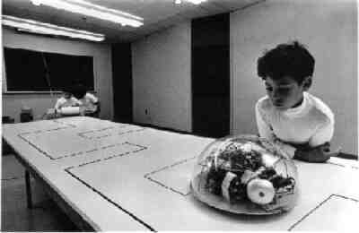

---

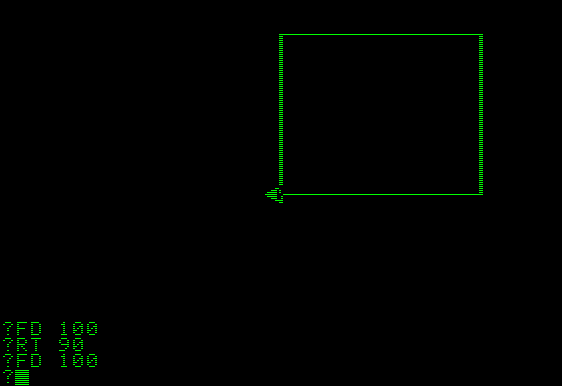

---

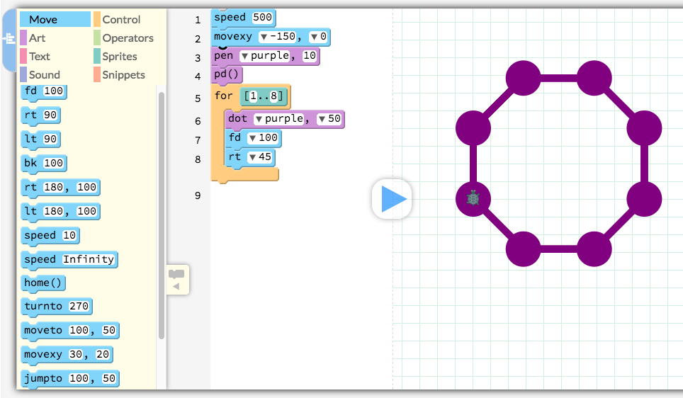

---

# Pencil Code

- A free, online *Hybrid Coding Environment*
- Uses a *General-Purpose Programming Language* called [CoffeeScript](https://coffeescript.org/), which can be used for web development
- You can also change the language to [JavaScript](https://developer.mozilla.org/bm/docs/Web/JavaScript), which is more commonly used by professional coders
- You can switch between *Blocks* and *Text* views
- 3 themed interactive tutorials: *Draw*, *Jam* and *Imagine*

---

# Drawing a Sky Full of Stars

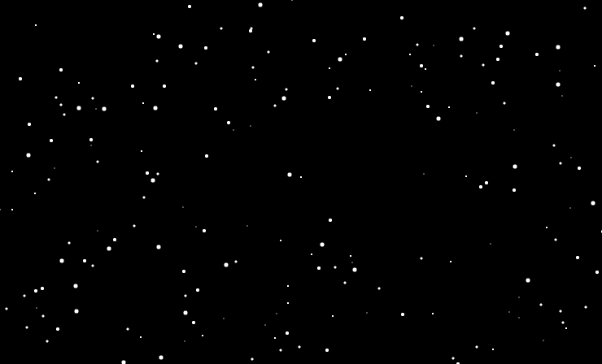

---

# Drawing a Dot

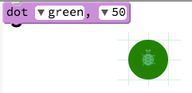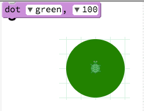
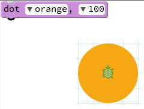

---

# Change the Background Colour

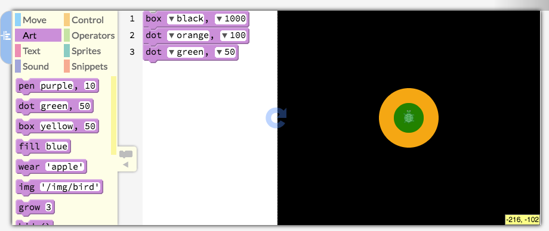

---

# Pencil Code Colour Reference

---

# Different Background Colours

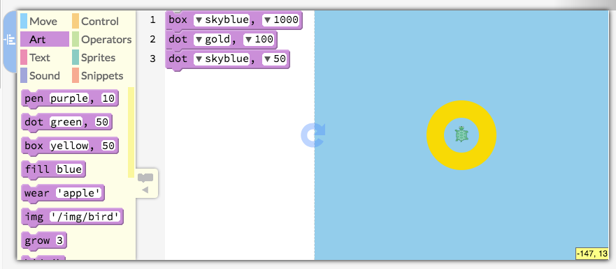

---

# Moving the Turtle

- We can also move the Turtle on the Canvas:
	- *fd:* it moves forward a number of steps
	- *bk:* it moves backwards a number of steps
	- *lt:* it turns by a number of degrees to the left
	- *rt:* it turns by number of degrees to the right
- We will start by moving the Turtle forward

---

# Drawing a Snow Kid in a Sequence

- Use the blocks below a starter and add *fd* and *dot* blocks to draw a Snow Kid

---

# Loops in Pencil Code

- Do you remember what *Loops* are?
- We use *Loops* to repeat steps multiple times
- For example, the *repeat* block in Scratch
- Pencil Code has a command called *for*, in the *Control* section, which is similar to repeat

---

# Drawing a Line of Dots

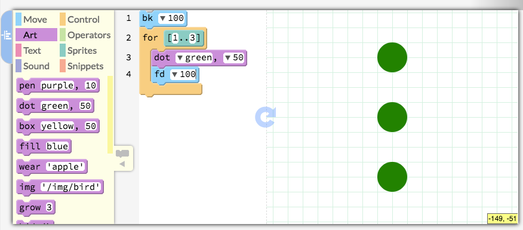

---

# Speeding the Turtle Up

---

# Operators

- All of the blocks in the *Operators* section
- Variety of different functions and purposes 
- E.g. addition, subtraction, multiplication & division
- We will focus on the *random* block in today's session

---

# Random Sized Dots

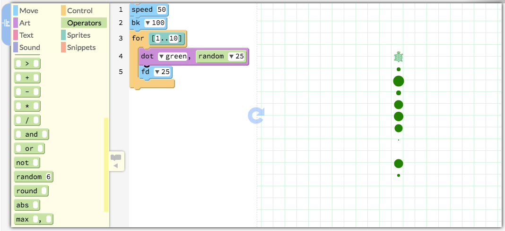

---

# Random Coloured Dots

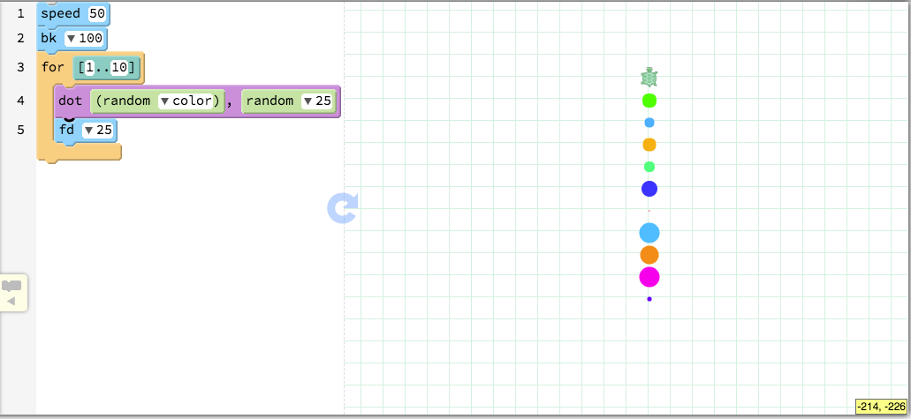

---

# Moving the Turtle Around

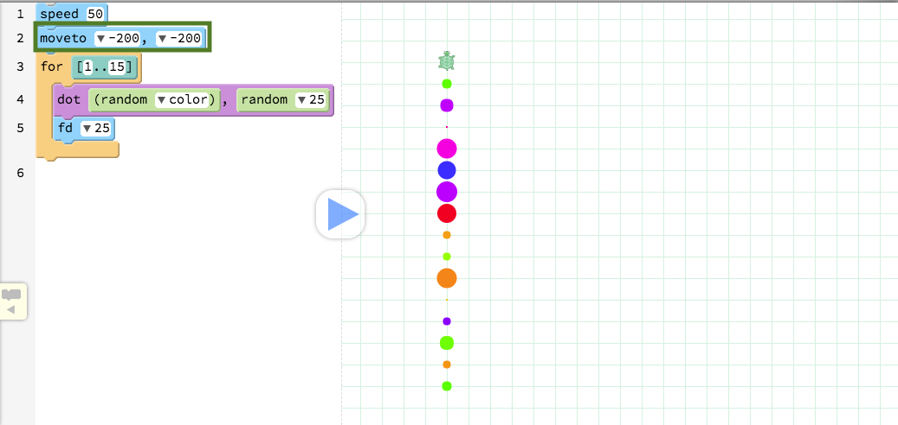

---

# Drawing Three Lines

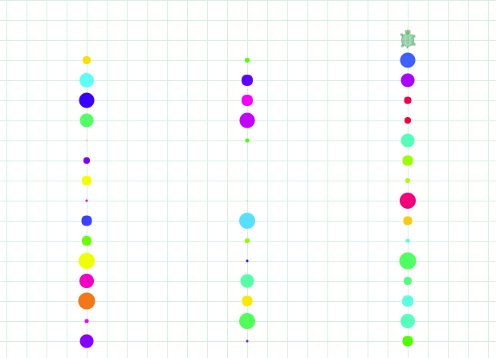

- Use the *moveto* command with the *for* loop to draw a picture similar to the one above
- Hint: by switching to the *Text* mode, you can copy and paste commands

---

# Drawing a Starry Night

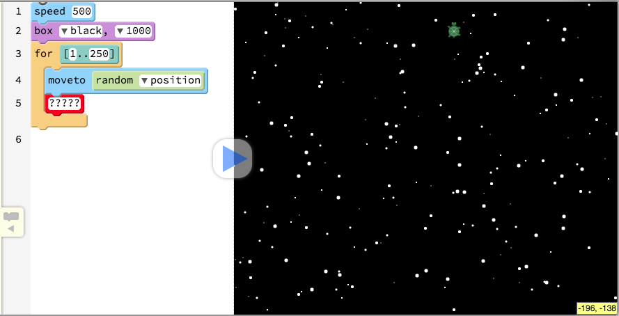

---

# Creating Dot Paintings

---

# Drawing a Circle of Dots

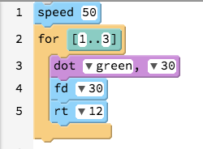

- What should we change to make it draw this pattern?

---

# Forward and Backwards

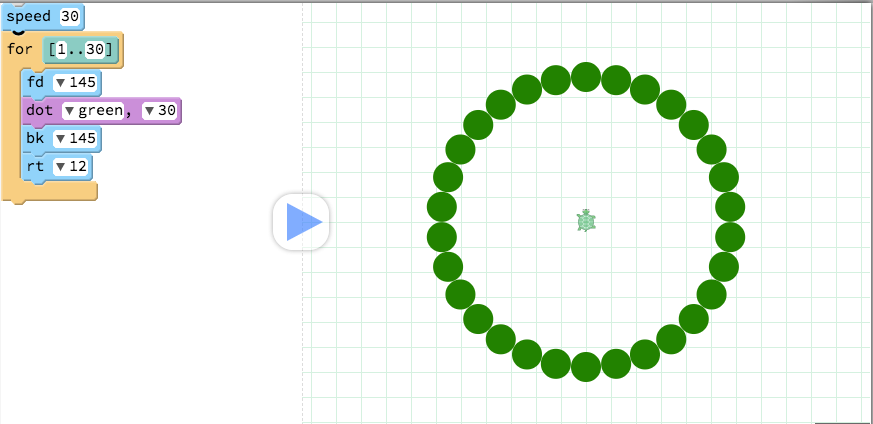

---

# Background and Colour Change

---

# Drawing the Other Circles

Pattern  |  Degrees in Each Turn  |  Times Repeated  |  Steps Forwards & Backwards
---------|------------------------|------------------|------------------------------
1        |  10                    |  36              |  175
2        |  12                    |  30              |  145
3        |  15                    |  24              |  115
4        |  20                    |  18              |  85
5        |  30                    |  12              |  55

---

# An Extra 2 Dots

- In the next steps we will draw patterns that overlap with each other, so we will also add a *big dot*
- Put the command at the top of your script (before all the *for* blocks): *dot 380, mediumturquoise*
- We also want a *dot in the middle* at the end
- After you have drawn all of the other patterns, add this command (to draw the last dot in the middle): *dot 30, white*

---

# Creating a Function

- A *Function* is a way of "encapsulating" common instructions
- We can take a set of instructions (such as drawing the dot patterns) and put them into one instruction
- If you have used *Custom Blocks* (through the *Make a block* button) in *Scratch*, you have created a *Function*
- *fd*, *speed* and other blocks are examples of in-built *Functions* in *Pencil Code*, but you can also create your own *Functions* as well

---

# Creating a Function to Draw the Pattern

- Say that we wanted to draw our pattern of circles on other spots on the Canvas more than once
- How could we do that?
- We could copy/paste the instructions a few times **but** there is a way that is neater

---

# Functions in Pencil Code

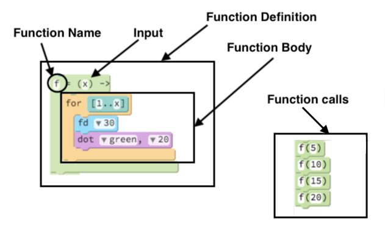

---

# Function Example

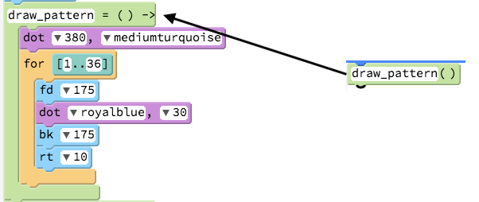

---

# Drawing the Pattern in Different Spots

- How can you combine the *draw_pattern* and *moveto* blocks to make a picture like below?

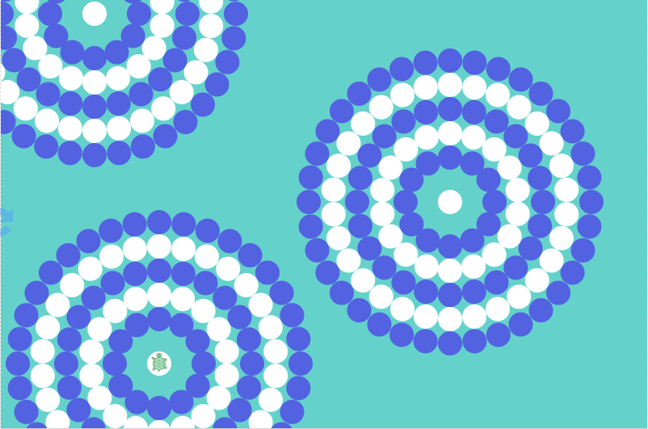

---

# Extensions 

- If you finish all of the previous steps, you could:
	- change the colours of the different patterns
	- add more patterns on the Stage 
	- put all of the instructions that draw a pattern into one *Function* called *draw_circle* with inputs: *repeat*, *steps* and *degrees*
	- make it so that the colour of the dots are *random*
